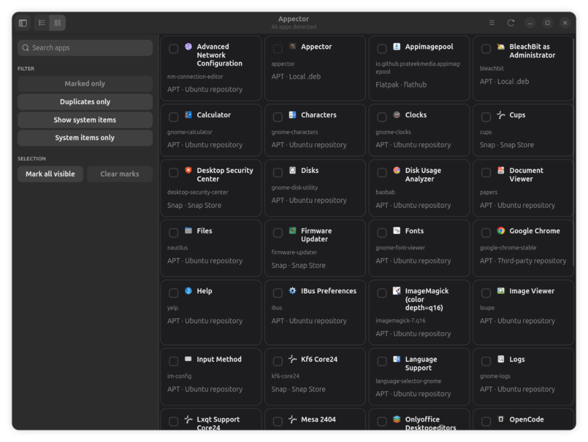
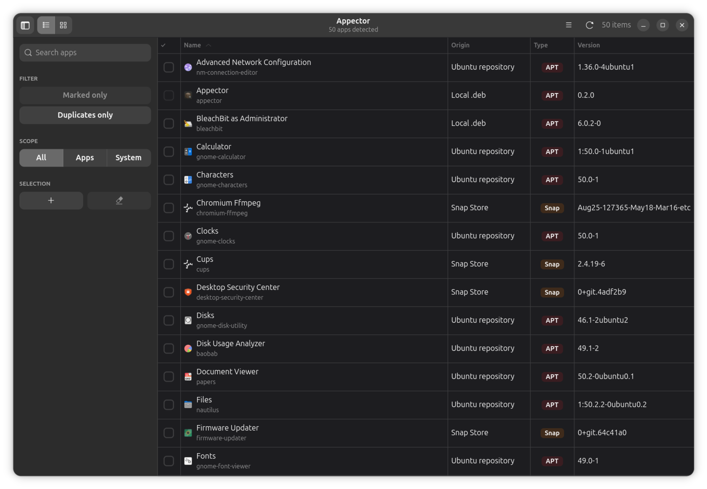
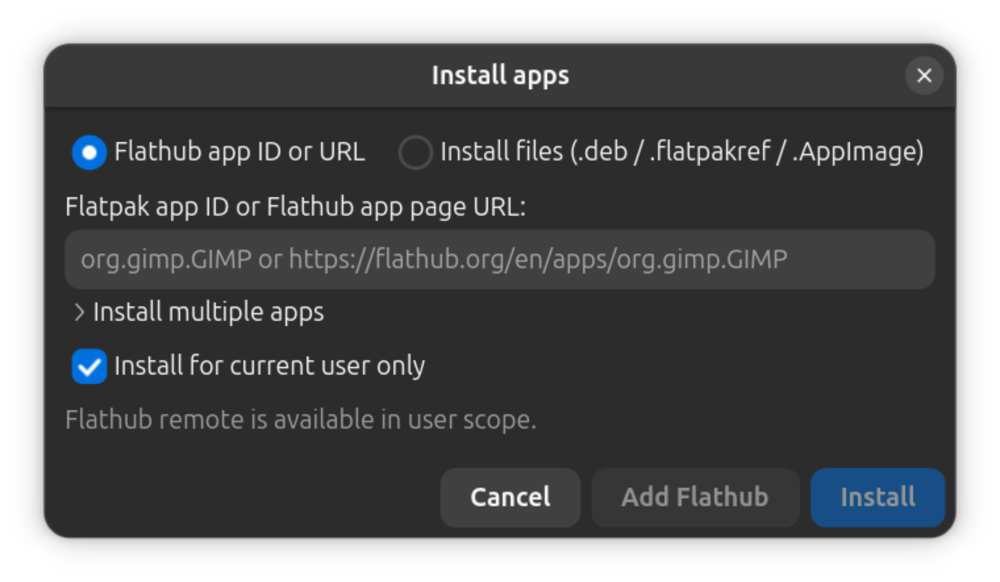
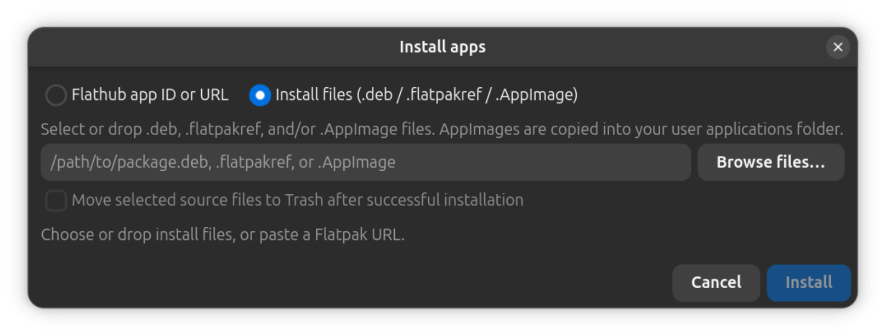
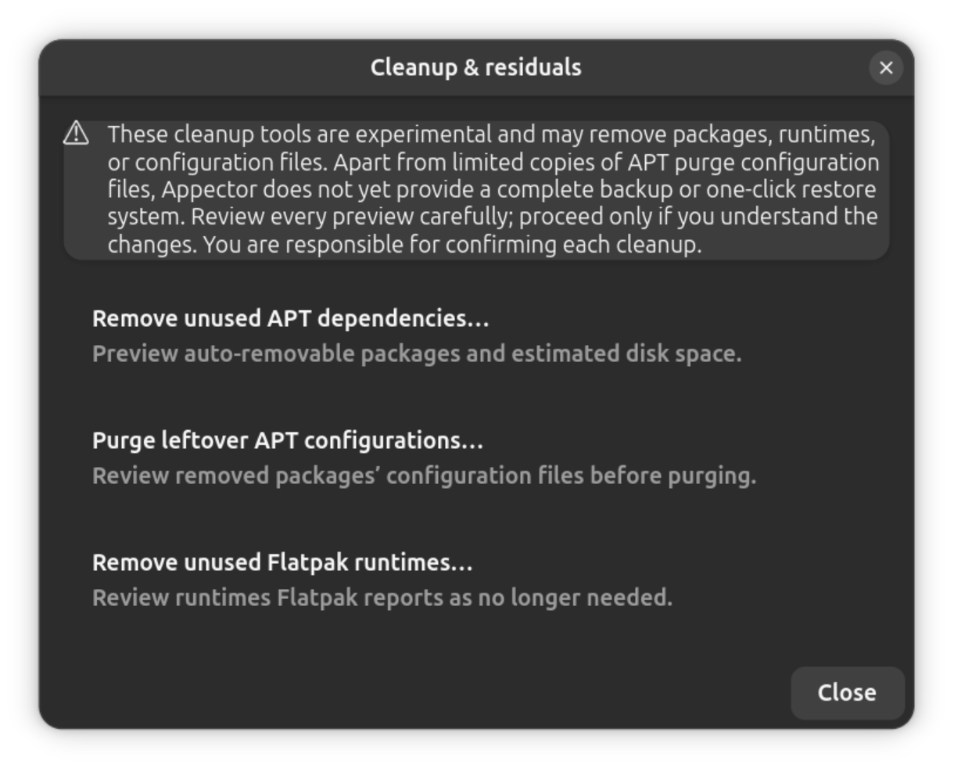

# Appector

Appector is a desktop app for listing, removing or installing software
and performing package-management tasks on Linux. It can list APT, Snap,
Flatpak, AppImage, and detected manual installs; install local `.deb`,
`.flatpakref`, and AppImage files; and preview selected cleanup operations.

<p align="center">
  
</p>

## Screenshots

<p align="center">
  
  <br><br>
  
  <br><br>
  
  <br><br>
  
  <br><br>
  
</p>

## Features

- Uninstall existing apps those were installed form different sources, manually, APT, snap, AppiIage, FLatpak. Batch uninstall is also supported.
- Install applications from .deb, .AppImage, .flatpakref files or directly from FlatHub URL/ID. Batch install is also supported, as well as drag & drop.
- Find duplicate application in the system.
- Check for application updates in one place. (Except manually installed apps)
- Export existing app list as CSV or JSON.
- (EXPERIMENTAL)Remove APT, Flatpak residuals.
- Filter the app list by scope: all items, applications only, or system items only.

## Architecture

Behavior-changing decisions are recorded in `docs/decisions/`:

- [ADR-0001: Gate every APT residual purge behind a full pre-flight](docs/decisions/0001-gate-apt-residual-purge.md)
- [ADR-0002: Split safety policy, process execution, and the residual subsystem](docs/decisions/0002-split-safety-policy-and-residual.md)

Module layout:

| Module | Responsibility |
|---|---|
| `appector/policy.py` | Removal safety decisions. No I/O. |
| `appector/_proc.py` | Command execution, apt lock, activity log. |
| `appector/residual.py` | APT residual-configuration purge end to end. |
| `appector/actions.py` | Install/update/remove across apt, snap, Flatpak, AppImage. |
| `appector/scanners.py` | Discovery of installed apps. |
| `appector/window.py` | GTK/libadwaita user interface. |

## Limitations
- Appector only supports Debian based distributions at the moment.
- No fully back-up/restor functionality is implemented still, any modifications should be done with caution.
  
## Download and install

The source repository is public:
[`ell-shad/appector`](https://github.com/ell-shad/appector). Binary `.deb`
packages are attached to that same repository's GitHub Releases, and the
matching source is available from the same public repository and release tag
(including GitHub's source archive). The `.deb` also contains Appector's
Python source files.

Download `appector_<version>_all.deb` and `SHA256SUMS` from the GitHub
Releases page. Verify the checksum in the same directory, then install:

```bash
sha256sum --check SHA256SUMS
sudo apt install ./appector_<version>_all.deb
```

### Upgrading from an earlier version

Appector checks for updates on demand from **Check for Appector updates…** in
the main menu. It contacts only GitHub's Releases API and opens the release
page; it never downloads or installs anything by itself. Install the `.deb`
manually as shown above.

Note that GitHub does not return pre-releases from the "latest release"
endpoint, so a version published as a pre-release will not be offered by the
in-app check even though it appears on the Releases page.

Launch **Appector** from the applications menu or run `appector`. The package
declares GTK 4, libadwaita, PyGObject, and GdkPixbuf introspection packages as
system dependencies; `apt` installs these. Optional package managers such as
Snap and Flatpak are not required. `Architecture: all` means the Python files
are architecture-independent; it does not mean every target architecture has
been tested. Do not run the GUI as root; privileged operations use system
authorization prompts when available. Removal of manual app files that require
administrator privileges is intentionally blocked until a race-resistant
privileged helper is implemented.

`appector --help` shows the available launcher options and `appector --version`
prints the installed version.

To remove Appector:

```bash
sudo apt remove appector
```

To remove its system package configuration as well:

```bash
sudo apt purge appector
```

These commands do not remove Appector's per-user state or AppImages.

## Supported systems

The initial target is Ubuntu 26.04 amd64, matching the audit host. The package
was built and statically validated on that host, but it has not yet been
installed or integration-tested there, so this is a target rather than a
verified support claim. `Architecture: all` means the Python files are
architecture-independent; it does not establish compatibility with arm64 or
other distributions. Debian stable, older Ubuntu releases, Linux Mint,
Pop!_OS, and Raspberry Pi OS need their own compatibility and install tests
before support is claimed.

## Usage and destructive actions

Refresh the installed-app list, search and filter it, inspect an app's details,
and use the main menu for installation, exports, update checks, and maintenance.
Removal and cleanup can delete packages, package configuration, or files.
Review each preview and confirmation carefully; package-manager transactions
can affect dependencies beyond the selected app.

Before installing local `.deb` files, Appector stages an unchanged private
copy, displays package name/version/architecture/maintainer/dependencies,
file size and SHA-256, and shows an APT transaction simulation. Installation
is blocked if metadata or the transaction preview cannot be produced, or if
the package architecture does not match the system. The hash identifies the
selected file but does not authenticate its publisher; local package
signatures/origin are not verified. Installing a `.deb` can run maintainer
scripts with administrator privileges. Only continue if you trust its source
and approve the packages/actions shown. Review the final APT prompt too,
because system state or package sources can change after the simulation.

When Appector purges APT residual configurations it first backs up dpkg-listed
conffiles under:

```text
~/.local/state/app-manager/purge-backups/
```

The backup includes a `manifest.json` and copies under `files/`. Appector
keeps only the 10 most recent purge backups and prunes older ones; use
**Cleanup & residuals… → Browse…** to inspect the saved manifests and file
records. There is no in-app restore action. To restore a file, inspect its
manifest record, confirm the target is safe, and restore the saved copy to the
recorded absolute path with appropriate ownership and mode; system paths
require administrator privileges. Do not blindly copy an entire backup tree
over the filesystem. If the backup is incomplete, Appector refuses to start
the purge.

Residual purging is gated before anything is removed: package names are
validated, dpkg residual (`rc`) state is verified, `apt-get --simulate purge`
must confirm the exact selection, and the backup must complete. The `rc` state
is re-checked after the backup so a package that was reinstalled in the
meantime is not purged as if it were only residual configuration. Appector
blocks a purge whose simulation touches packages beyond the selection, and
only covers dpkg-registered conffiles: maintainer `postrm` scripts can delete
additional files, which is why the simulation is the authoritative preview.

App data and activity state are stored per user:

- `~/.local/share/app-manager/appimages/` — managed AppImage copies.
- `~/.local/share/applications/` — Appector-created AppImage launchers.
- `~/.local/state/app-manager/actions.log` — activity log.
- `~/.local/state/app-manager/marked.json` — staged removal marks.
- `~/.local/state/app-manager/ui.json` — window and view preferences.
- `~/.local/state/app-manager/purge-backups/` — pre-purge conffile backups.

The activity log, staged removal marks, purge backups, and newly generated
CSV/JSON exports are written with user-only permissions. The activity log can
contain package names, operation results, and local paths; exports can reveal
software installed on the machine. Review both before sharing.

Staged removal marks are a to-do list, not a scheduled operation: they are
restored between sessions so an unfinished selection survives a restart, but
removal never happens without a fresh preview and confirmation.

## Appector updates and network use

**Check for Appector updates…** is a manual menu action. It requests the latest
stable release metadata from
`https://api.github.com/repos/ell-shad/appector/releases/latest`.
GitHub's `latest` endpoint excludes drafts and pre-releases, so versions
published as pre-releases are not offered here. When a newer release is found,
Appector opens that release page; it never downloads or installs the update
itself.
Install a downloaded package with `apt install ./file.deb` after reviewing the
release and package.

There is no background update check and no telemetry or analytics. Package
installation and update actions use the locally configured APT, Snap, or
Flatpak services and their configured software sources; installing from
Flathub may contact `https://dl.flathub.org/repo/flathub.flatpakrepo`.
The GitHub Releases API is the only direct Appector update-check endpoint.

A `.deb` installed from a GitHub Release does **not** configure an APT
repository and will not receive upgrades through `apt upgrade`. A tag matching
the version in `appector/__init__.py` builds the package, creates
`SHA256SUMS`, and publishes the assets as a release in this repository using
GitHub Actions' automatically provided token. The `public-release` Actions
environment is a publication approval gate; configure a required reviewer
before publishing.

Whether a version is published as a pre-release is decided by its changelog
heading, not by the version number: a heading suffixed with `Prerelease` is
published as a GitHub pre-release, and any other heading is published as a
full release. Only full releases appear on `/releases/latest`, so a version
meant to be offered by the in-app update check must not be marked
`Prerelease`.

Release checksums are not signed. The release workflow is configured to
generate GitHub build-provenance attestations for the `.deb`; an attestation
will be available only after a release workflow succeeds. To verify a
downloaded package with GitHub CLI, run:

```bash
gh attestation verify ./appector_<version>_all.deb --repo ell-shad/appector
```

GitHub-generated source archives are available from the same tag and contain
the source/build scripts for that binary version. A signed APT repository
(for example, GitHub Pages with aptly/reprepro, or a hosted package
repository) is a possible later improvement; it is not configured here.

## Build from source

On Debian or Ubuntu, install the runtime/build prerequisites:

```bash
sudo apt install python3 python3-gi gir1.2-gtk-4.0 gir1.2-adw-1 \
  gir1.2-gdkpixbuf-2.0 dpkg
```

Then, from a checkout:

```bash
python3 run.py
./scripts/build-deb.sh
```

The package builder creates `dist/appector_<version>_all.deb`. It does not
install the package or publish a release. Automated tests can be run with:

```bash
python3 -m unittest discover -s tests -v
```

## Troubleshooting and recovery

- If an operation fails, review its details in **Activity Log** and inspect
  APT's state with `sudo dpkg --audit`.
- To complete interrupted package configuration, review the proposed changes
  and run `sudo dpkg --configure -a` if appropriate.
- For package-manager lock errors, wait for the other APT/dpkg operation to
  finish; do not remove lock files manually.
- If the desktop app cannot start, check that GTK 4, libadwaita, and PyGObject
  are installed and launch `appector` from a terminal to see diagnostic
  output.
- Before sharing logs or exports, remove personal paths and installed-software
  details that you do not wish to disclose.

Report bugs at
<https://github.com/ell-shad/appector/issues> with the distribution/release,
architecture, Appector version, and a redacted error or log excerpt. Do not
post credentials, private logs, or personal installed-app exports.

##  Disclaimer
Appector is currently in an experimental/beta stage of development. While it 
has been developed and tested with the assistance of AI tools under strict 
human review, it is not yet perfect and may contain bugs.
• No Backup/Restore: Full backup and restore functionality is not yet implemented.
Please modify settings or manage your applications with caution.
• User Responsibility: Using this software on a live or production system is done 
entirely at your own risk. The developer(s) assume no responsibility for data loss, 
system instability, or any other issues.
This software is provided "as is", without warranty of any kind.

## License and security

Copyright © 2026 Elshad Guliyev. Appector's original application code is
distributed under the GNU General Public License version 3; see
[`LICENSE`](./LICENSE). No third-party application source or artwork is
currently bundled. Runtime libraries such as Python, PyGObject, GTK 4,
libadwaita, and GdkPixbuf are system dependencies and retain their own
licences.

Appector is not affiliated with or endorsed by Debian, Ubuntu, Canonical,
Flathub, or the Snap Store.

For security issues, follow [`SECURITY.md`](./SECURITY.md). Do not include
credentials or unredacted private logs in public reports.
